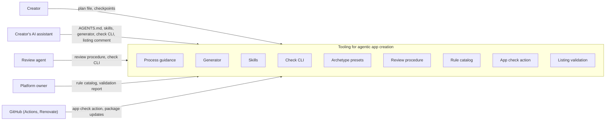

# System Scope and Context

The system is the tooling for building and validating apps: process guidance, generator and archetypes, skills,
rules and checks, the validation and its report. It lives mostly in lernapps/tooling, with the archetype templates in
lernapps/app-template and the listing validation in lernapps/apps (chapter 5).

Outside the system: the people and assistants who use it, GitHub where it runs, and the parts of lernapps.net it
depends on but does not own. The shared site frame (`@lernapps/site` in lernapps.github.io) gives apps on
lernapps.net their header, footer and the site check; the entry schema belongs to lernapps/apps; apps are hosted on
lernapps.net's GitHub Pages or anywhere else.

## Context overview

```arc42
:::diagram
id: context-overview
view: context
notation: mermaid
:::
```



## Creator

A teacher, parent or student who builds an app for a gap they noticed ([app creators](https://lernapps.net/docs/platform-design/#1-exploration/e2-scan.pdt42.md:el-e-creators)). They talk to their assistant,
read the plan file and confirm it; after that, they are asked only at the checkpoints. They never need to know the
rules or the toolchain.

```arc42
:::actor
id: actor-creator
title: Creator
type: person
description: Builds an app with their AI assistant; reads and confirms the plan
requires: if-plan-file
:::
```

## Creator's AI assistant

Claude Code, Codex, Gemini CLI or another agent, chosen by the creator ([AI assistants](https://lernapps.net/docs/platform-design/#1-exploration/e2-scan.pdt42.md:el-e-ai-assistants)). It reads `AGENTS.md`,
writes the plan, runs the generator, follows the skills, reacts to the checks and fills the entry. It is a partner the
platform designs for, not part of the system.

```arc42
:::actor
id: actor-assistant
title: Creator's AI assistant
type: system
description: Any coding agent; works from plain files and CLIs, no MCP server required
requires: if-agents-md, if-plan-file, if-generator-cli, if-skills, if-check-cli, if-listing-comment
:::
```

## Platform owner

Decides whether an app is listed, maintains the rule catalog and runs the review and the evals (one owner,
`con-one-owner`). Reads the validation report and the retrospective.

```arc42
:::actor
id: actor-owner
title: Platform owner
type: person
description: Decides listing, maintains the rules, runs review and evals
requires: if-rule-catalog, if-validation-report, if-review-procedure
:::
```

## Review agent

An agent in a fresh context, run by the owner. It follows the review procedure,
starts from the check CLI's report and judges what the checks cannot decide.

```arc42
:::actor
id: actor-review-agent
title: Review agent
type: system
description: Fresh-context agent that validates an app before listing
requires: if-review-procedure, if-check-cli, if-validation-report
:::
```

## GitHub

Runs the app repo's workflows and the listing validation in lernapps/apps (GitHub Actions), serves Pages, and keeps
every app's tooling current (Renovate with the organisation's preset).

```arc42
:::actor
id: actor-github
title: GitHub (Actions, Pages, Renovate)
type: system
description: Runs CI and the listing validation; Renovate bumps the tooling package in every app
requires: if-app-check-action, if-archetype-preset
:::
```
