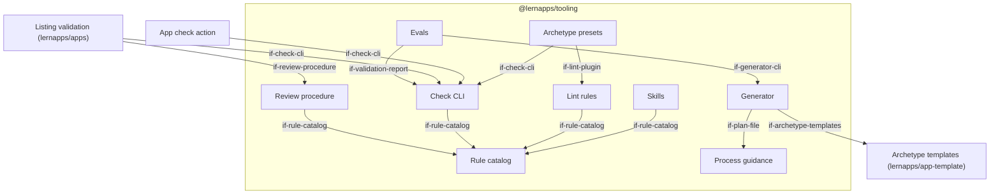
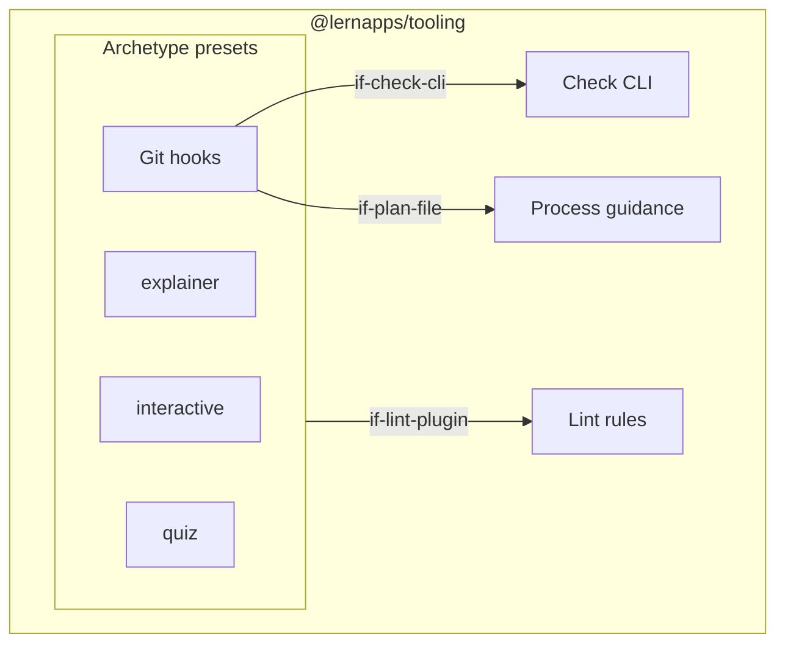

# Building Blocks

The tooling is one package, `@lernapps/tooling`, at the root of lernapps/tooling, installed by apps from git at a
commit of `main` and kept current by Renovate, like the site frame `@lernapps/site` (decision `dec-one-package`).
Its parts are subpath exports and CLI commands of that package. Two blocks live in other repos: the archetype
templates in lernapps/app-template and the listing validation in lernapps/apps. Planned folders are named in the prose;
`path` is set only where the code exists.

## Level 1

```arc42
:::diagram
id: building-blocks-level-1
view: building-block
notation: mermaid
:::
```



## Level 2: archetype presets

```arc42
:::diagram
id: building-blocks-archetypes
view: building-block
notation: mermaid
roots: bb-archetypes
:::
```



## @lernapps/tooling

The one package every app depends on. Its version is a commit of `main`; Renovate moves every app to the latest
commit and merges when the app's checks are green (preset `github>lernapps/tooling`). It has a single CLI, `lernapps`,
with the commands `create` (generator) and `check` (check CLI).

```arc42
:::building-block
id: bb-tooling-package
title: "@lernapps/tooling"
technology: TypeScript, Node 24, npm package installed from git
:::
```

### Rule catalog

Every rule, once: id, text, scope (`listing`, `site`, `archetype:<name>`), severity (`error`, `warning`, `hint`),
enforcement (`guided`, `checked`, `reviewed`), pitfalls and source (concept `concept-rule-model`). One YAML file per
rule in `rules/`, validated against a schema. Skills, lint configuration, check CLI and review rubric are generated
from it or read it; a page on lernapps.net/tooling/ lists the rules for people.

```arc42
:::building-block
id: bb-rule-catalog
title: Rule catalog
parent: bb-tooling-package
technology: YAML, JSON Schema
implements: concept-rule-model, concept-promotion-path
:::
```

#### Rule catalog interface

The rules as data, with their schema. Consumers select rules by scope and enforcement.

```arc42
:::interface
id: if-rule-catalog
title: Rule catalog
provider: bb-rule-catalog
protocol: YAML files with JSON Schema, read at build time
:::
```

### Process guidance

The EPCC workflow for the creator's assistant (`guidance/`): the text of the app's `AGENTS.md` (short, always loaded,
pointing to the skills), and the plan template with its phases, checkpoints, the questions of the Explore phase
(including "fetch the entry schema and fill it"), the front matter with counters and the closing retrospective,
each explained in comments (concept `concept-plan-file`).

```arc42
:::building-block
id: bb-process-guidance
title: Process guidance
parent: bb-tooling-package
technology: Markdown
implements: concept-plan-file
:::
```

#### AGENTS.md

The entry point every assistant reads. Generated into the app; it stays short and refers to the skills and the
plan, which come from the package.

```arc42
:::interface
id: if-agents-md
title: AGENTS.md
provider: bb-process-guidance
protocol: Markdown file at the app's root
:::
```

#### Plan file

The human-readable plan in the app repo (`.vibe/plan.md`): phases with tasks, key decisions, the catalog notes,
front matter counters written by the hooks, and the retrospective.

```arc42
:::interface
id: if-plan-file
title: Plan file
provider: bb-process-guidance
protocol: Markdown with YAML front matter
:::
```

### Skills

Conventions as skills in the agentskills.io format (`skills/`): `lernapps-app` (workflow and general rules),
one per archetype (`lernapps-explainer`, `lernapps-interactive`, `lernapps-quiz`), topic skills (third-party content,
videos, curriculum references) and `lernapps-listing` (fetch the entry schema, fill it from plan and report, open
the pull request). The rule sections are generated from the rule catalog. Shipped in the package and synced into the
app's `.agents/skills/`; also installable with `npx skills add lernapps/tooling` for apps built otherwise.

```arc42
:::building-block
id: bb-skills
title: Skills
parent: bb-tooling-package
technology: Markdown (agentskills.io)
requires: if-rule-catalog
implements: concept-rule-model, concept-third-party-content
:::
```

#### Skills interface

The skills the assistant loads when a task needs them; one per concern, each pointing to the rules it carries.

```arc42
:::interface
id: if-skills
title: Skills
provider: bb-skills
protocol: SKILL.md files in .agents/skills/
:::
```

### Generator

`lernapps create --archetype <name>` writes a new app from the archetype's template at the commit pinned in the
package: thin files that refer to the package (vite-plus config, `tsconfig.json`, hooks), `AGENTS.md`, the plan
file carried over from the conversation, the app's workflows, LICENSE and the content-error issue form. It is run
after the creator has confirmed the plan.

```arc42
:::building-block
id: bb-generator
title: Generator
parent: bb-tooling-package
technology: TypeScript CLI
requires: if-archetype-templates, if-plan-file
implements: concept-versioned-distribution
:::
```

#### Generator CLI

The assistant runs it once, after the plan is confirmed; it fails if the archetype is unknown or the folder is not empty.

```arc42
:::interface
id: if-generator-cli
title: Generator CLI
provider: bb-generator
protocol: CLI `lernapps create`
:::
```

### Archetype presets

What an app imports and never edits (`archetypes/`): per archetype the vite-plus configuration (lint, format, type
check, test, staged), the strict `tsconfig` base, i18n and a11y helpers, and the git hooks. A shared base holds what
all archetypes have in common.

```arc42
:::building-block
id: bb-archetypes
title: Archetype presets
parent: bb-tooling-package
technology: TypeScript, vite-plus
requires: if-lint-plugin, if-check-cli
implements: concept-strict-typescript, concept-i18n-a11y, concept-versioned-distribution
:::
```

#### Archetype preset interface

What an app imports and extends: the vite-plus configuration, the `tsconfig` base and the hooks, by archetype.

```arc42
:::interface
id: if-archetype-preset
title: Archetype preset
provider: bb-archetypes
protocol: npm subpath exports (config, tsconfig, hooks)
:::
```

#### Git hooks

Installed by the preset (`vp config`). Pre-commit runs `vp staged` (format, lint, type check of staged files).
Pre-push runs `vp check`, the tests, the build and the static part of the check CLI; when it fails, it increments
`prePushFailures` in the plan file's front matter and prints the check messages.

```arc42
:::building-block
id: bb-git-hooks
title: Git hooks
parent: bb-archetypes
technology: vite-plus staged, shell
requires: if-check-cli, if-plan-file
implements: concept-agent-messages, concept-measurement
:::
```

#### explainer

Content-heavy apps after the Mathe-Karte: one page per topic with explanation, picture and generated exercises, a
start and a test page, every page readable without JavaScript. Pages are rendered at build time from TypeScript
sources; exercise generators and checkers are pure, tested functions; `llms.txt` and a tutor link make the app usable
with an AI tutor. How pages are rendered from TypeScript is decided in `dec-explainer-rendering`.

```arc42
:::building-block
id: bb-archetype-explainer
title: explainer
parent: bb-archetypes
technology: TypeScript, static rendering at build time, small client modules
:::
```

##### Topic pages

What an explainer creator writes: one page per topic (front matter with explanation, rule, example, picture),
exercise generators and checkers as pure functions, and the German texts. Typed, validated at build time.

```arc42
:::interface
id: if-topic-pages
title: Topic pages
provider: bb-archetype-explainer
protocol: Markdown with typed front matter, TypeScript modules
:::
```

#### interactive

A client-rendered single-page app plus a static start page that explains it and a `<noscript>` note. Keyboard and
pointer interaction, state in memory or on the device only, rendering with DOM, SVG or canvas.

```arc42
:::building-block
id: bb-archetype-interactive
title: interactive
parent: bb-archetypes
technology: TypeScript, Vite
:::
```

##### App module

What an interactive creator writes: the app's TypeScript module behind a small contract with the preset (mount
point, i18n texts, storage wrapper, start page text).

```arc42
:::interface
id: if-app-module
title: App module
provider: bb-archetype-interactive
protocol: TypeScript module contract
:::
```

#### quiz

The deepest scaffold: the whole quiz is built in, the creator supplies only the question bank. The engine renders
every question statically (readable without JavaScript, answers revealed at the end of the page) and enhances it in
the browser: question types, feedback per option and explanation per question, scoring, order shuffled by a seed in
the address, deep links to a question, nothing stored except optionally the last result on the device.

```arc42
:::building-block
id: bb-archetype-quiz
title: quiz
parent: bb-archetypes
technology: TypeScript, static rendering at build time
:::
```

##### Question bank

The only thing a quiz creator writes: questions, options, correct answers, feedback and explanations as typed data,
validated at build time. Question types: decided in `dec-quiz-question-types`.

```arc42
:::interface
id: if-question-bank
title: Question bank
provider: bb-archetype-quiz
protocol: TypeScript types and JSON Schema; data files in the app
:::
```

### Lint rules

The `checked` rules that can be decided on source code (`lint/`), as an Oxlint JS plugin (fallback: ESLint plugin):
no URLs to other hosts in code, storage only through the wrapper of the preset, learner texts only from the i18n
files, no `any`. Severity per rule comes from the catalog; a suppression needs a reason.

```arc42
:::building-block
id: bb-lint-rules
title: Lint rules
parent: bb-tooling-package
technology: TypeScript, Oxlint JS plugin
requires: if-rule-catalog
implements: concept-rule-model, concept-agent-messages
:::
```

#### Lint plugin

The preset loads the plugin with the severities from the catalog; apps do not configure it themselves.

```arc42
:::interface
id: if-lint-plugin
title: Lint plugin
provider: bb-lint-rules
protocol: Oxlint / ESLint plugin API
:::
```

### Check CLI

`lernapps check <dir|url>` decides the `checked` rules on a built bundle or a deployed URL (`check/`). Static mode
reads the files: external resources, links, dependency licences, site rules (calling `lernapps-check` of the site
frame for scope `site`). Browser mode (`--browser`, Playwright with Chromium) loads every page: requests before a
click, storage, readable without JavaScript, 360 px without overflow, axe. Writes the validation report and prints
messages for agents. Runs without the app's source repository.

```arc42
:::building-block
id: bb-check-cli
title: Check CLI
parent: bb-tooling-package
technology: TypeScript CLI, Playwright, axe-core
requires: if-rule-catalog
implements: concept-rule-model, concept-agent-messages, concept-validation-report
:::
```

#### Check CLI interface

Exit code 0 when no `error` rule fails; messages in the shape of `concept-agent-messages`; `--report <file>` writes the validation report.

```arc42
:::interface
id: if-check-cli
title: Check CLI
provider: bb-check-cli
protocol: CLI `lernapps check`, exit code and messages
:::
```

#### Validation report

The result of a check run as JSON: commit (or URL and time), findings per rule id with location and fix, and the
fitness values for the entry. Its schema is published at lernapps.net next to the entry schema.

```arc42
:::interface
id: if-validation-report
title: Validation report
provider: bb-check-cli
protocol: JSON with published JSON Schema
:::
```

### Review procedure

The formal validation's judgment (`review/`): a prompt for an agent in a fresh context, the rubric generated from
the `reviewed` rules in scope, and the format of its verdict. The agent starts from the validation report, reads the
built bundle, the dependencies and the plan's retrospective, and judges what the checks cannot decide.

```arc42
:::building-block
id: bb-review-procedure
title: Review procedure
parent: bb-tooling-package
technology: Markdown
requires: if-rule-catalog, if-validation-report
implements: concept-rule-model, concept-promotion-path
:::
```

#### Review procedure interface

Run by an agent in a fresh context; its verdict names the reviewed commit and, per finding, the rule and the layer it should move to.

```arc42
:::interface
id: if-review-procedure
title: Review procedure
provider: bb-review-procedure
protocol: Markdown prompt and rubric
:::
```

### Evals

Sample creator prompts, at least one per archetype, with the expected result (`evals/`). Run by hand with Claude
Code, Codex and Gemini CLI on their latest models; scored with the check CLI, the review procedure and the plan's
counters. Run before a change to the guidance is merged.

```arc42
:::building-block
id: bb-evals
title: Evals
parent: bb-tooling-package
technology: Markdown prompts, scoring script
requires: if-generator-cli, if-check-cli, if-validation-report, if-review-procedure
implements: concept-measurement
:::
```

## Archetype templates

lernapps/app-template, one folder per archetype: the files the generator copies, each a working app that passes
every check. Each folder can be tried on its own; the logic stays in the package.

```arc42
:::building-block
id: bb-app-template
title: Archetype templates
technology: lernapps/app-template, one folder per archetype
:::
```

### Archetype templates interface

The generator copies one folder at the commit pinned in the package, so templates and presets change together.

```arc42
:::interface
id: if-archetype-templates
title: Archetype templates
provider: bb-app-template
protocol: Files at a pinned commit of lernapps/app-template
:::
```

## App check action

A composite action next to the site actions (`actions/app-check`): build, check CLI with `--browser`, report as
artifact. Runs in every app's CI; apps on lernapps.net deploy with the site actions after it.

```arc42
:::building-block
id: bb-app-check-action
title: App check action
technology: GitHub composite action
requires: if-check-cli
:::
```

### App check action interface

Used in the app's `pages.yml` next to the site actions, pinned to a commit and bumped by Renovate.

```arc42
:::interface
id: if-app-check-action
title: App check action
provider: bb-app-check-action
protocol: GitHub Actions `uses:` at a pinned commit
:::
```

## Listing validation

A workflow in lernapps/apps on pull requests that add or change an entry: runs the check CLI against the entry's URL,
compares the report with the declared fitness values and, if checks fail, posts the deterministic results as a
comment for the creator's assistant. The review agent then judges the rest; the owner decides.

```arc42
:::building-block
id: bb-listing-validation
title: Listing validation
technology: GitHub Actions workflow in lernapps/apps
requires: if-check-cli, if-review-procedure, if-validation-report
implements: concept-validation-report, concept-agent-messages
:::
```

### Listing results comment

The comment the listing validation posts on the pull request when checks fail: the deterministic results in the
shape of `concept-agent-messages`, so the creator's assistant can fix the app and push again.

```arc42
:::interface
id: if-listing-comment
title: Listing results comment
provider: bb-listing-validation
protocol: GitHub pull request comment
:::
```
