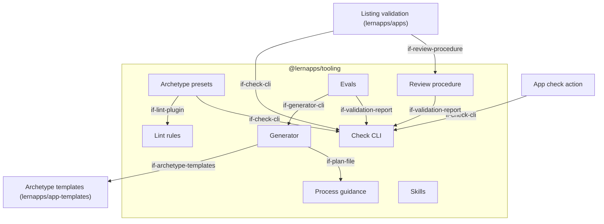
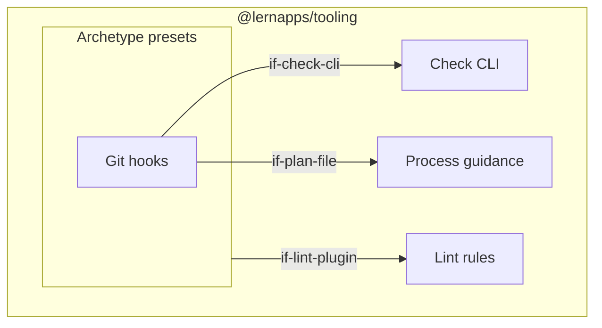

# Building Blocks

The tooling is one package, `@lernapps/tooling`, at the root of lernapps/tooling, installed by apps from git at a
commit of `main` and kept current by Renovate, like the site frame `@lernapps/site` (decision `dec-one-package`).
Its parts are subpath exports and commands of one CLI, `lernapps`. Two blocks live in other repos: the archetype
templates in lernapps/app-templates and the listing validation in lernapps/apps. Folders inside the package are
named in the prose.

Rules have no block of their own: each rule lives in the block where it acts, as skill text, lint rule, check or
rubric item (concept `concept-rule-catalog`).

## Level 1

```arc42
:::diagram
id: building-blocks-level-1
view: building-block
notation: mermaid
:::
```



## Level 2: archetype presets

```arc42
:::diagram
id: building-blocks-archetypes
view: building-block
notation: mermaid
roots: bb-archetypes
:::
```



## @lernapps/tooling

The one package every app depends on. Its version is a commit of `main`; Renovate moves every app to the latest
commit and merges when the app's checks are green (preset `github>lernapps/tooling`). An app holds only thin files
that refer to it: configuration that extends a preset, the hooks installed by it, skills synced from it. The
package's own build runs the same check command it gives apps, plus a test that the rule ids within skills, lint rules,
checks and rubric are unique and every message links to its rule.

```arc42
:::building-block
id: bb-tooling-package
title: "@lernapps/tooling"
technology: TypeScript, Node, npm package installed from git
implements: concept-stable-contracts
:::
```

### Process guidance

The EPCC workflow for the creator's assistant (`guidance/`): the text of the app's `AGENTS.md` and the plan
template. `AGENTS.md` is short and always loaded; it tells the assistant to keep a plan and points to the skills.

The plan template has the phases Explore, Plan, Code and Commit, each with its tasks and the creator's checkpoints
(confirm the plan, publish, list). Explore holds the questions for the creator, including what the entry schema of
the app overview needs to help adults find the app; the answers stay in the plan for listing. The front matter holds
the archetype, the current phase and counters the hooks write (`prePushFailures`). The plan ends with a
retrospective: phases reached, checks that failed and how often, the creator's turns after the plan was confirmed,
where the assistant had to guess. Comments in the template explain each part, so the template itself guides the
assistant.

```arc42
:::building-block
id: bb-process-guidance
title: Process guidance
parent: bb-tooling-package
technology: Markdown
implements: concept-plain-language, concept-terse-output, concept-traceability
:::
```

#### AGENTS.md

The entry point every assistant reads, generated into the app. It stays short and refers to the plan and the
skills.

```arc42
:::interface
id: if-agents-md
title: AGENTS.md
provider: bb-process-guidance
protocol: Markdown file at the app's root
:::
```

#### Plan file

The human-readable plan in the app repo (`.vibe/plan.md`). It stays in the creator's repo and reaches the platform
only with a listing. Its front matter has a versioned JSON Schema in the package; its headings (the four phases,
then the retrospective and its parts) are fixed, so hooks, review and evals can read it.

```arc42
:::interface
id: if-plan-file
title: Plan file
provider: bb-process-guidance
protocol: Markdown with YAML front matter
:::
```

### Skills

The rules as the assistant reads them, and the know-how around them (`skills/`), in the agentskills.io format: `lernapps-app` (workflow
and general rules), one per archetype, topic skills such as third-party content (bundle it at build time, name
source and licence next to it, embeds only after a click, links verified, never guessed), and `lernapps-listing`
(fetch the entry schema, fill it from plan and report, open the pull request). Each skill names the rule ids it
carries. They are synced from the package into the creator's agent harness (chapter 7) and can be installed alone
with `npx skills add lernapps/tooling` for apps built otherwise.

```arc42
:::building-block
id: bb-skills
title: Skills
parent: bb-tooling-package
technology: Markdown (agentskills.io)
implements: concept-rule-catalog, concept-plain-language, concept-terse-output
:::
```

#### Skills interface

The skills the assistant loads when a task needs them; one per concern.

```arc42
:::interface
id: if-skills
title: Skills
provider: bb-skills
protocol: SKILL.md files in the harness's skill folder
:::
```

### Generator

`lernapps create --archetype <name>` writes a new app from the archetype's template at the commit pinned in the
package: the thin files that refer to the package, `AGENTS.md`, the plan file carried over from the conversation,
the app's workflows, LICENSE and an issue form for content errors. The assistant runs it after the creator has
confirmed the plan.

```arc42
:::building-block
id: bb-generator
title: Generator
parent: bb-tooling-package
technology: TypeScript CLI
requires: if-archetype-templates, if-plan-file
implements: concept-stable-contracts
:::
```

#### Generator CLI

It fails if the archetype is unknown or the folder is not empty.

```arc42
:::interface
id: if-generator-cli
title: Generator CLI
provider: bb-generator
protocol: CLI `lernapps create`
:::
```

### Archetype presets

What an app imports and never edits (`archetypes/`), one preset per archetype on a shared base
(`archetypes/shared/`): the vite-plus configuration (lint with the lint plugin and the severity of each of its rules,
no `any`, type-aware with type check; format; unit tests; staged files; a build with relative URLs, so the app works
under any path), the strict `tsconfig` base, the Playwright configuration for end-to-end tests at desktop width and at
360 px, the helpers apps use at runtime (texts from the message files, announcements and focus for assistive
technology, storage on the device that keeps working when the browser blocks it), and the git hooks. An app's
`vite.config.ts` calls the preset, passing only its own settings, such as the pages to build; its `tsconfig.json`
only extends the base. The configuration files of an app thus stay one line each, and a change to a rule or a hook
reaches every app with the next version of the package.

```arc42
:::building-block
id: bb-archetypes
title: Archetype presets
parent: bb-tooling-package
technology: TypeScript, vite-plus, Playwright
requires: if-lint-plugin, if-check-cli
implements: concept-rule-catalog, concept-stable-contracts
:::
```

#### Archetype preset interface

What an app imports and extends: the vite-plus configuration, the `tsconfig` base, the Playwright configuration,
the runtime helpers and the hooks, by archetype. The helpers are typed by their TypeScript sources and run as built
modules.

```arc42
:::interface
id: if-archetype-preset
title: Archetype preset
provider: bb-archetypes
protocol: npm subpath exports (preset, tsconfig.json, playwright, storage, i18n, a11y) and the hooks directory
:::
```

#### Git hooks

Shell scripts in the package (`archetypes/shared/hooks/`), installed with the vite-plus hook dispatcher when the
app's dependencies are installed (`vp config --hooks-dir` pointing into the package, in the app's `prepare` script).
The app holds no hook scripts of its own. Pre-commit formats and fixes the staged files, then runs `lernapps check
--pre-commit`; pre-push runs `lernapps check --pre-push`; together they run exactly what CI runs. When the pre-push
run fails, the check CLI increments `prePushFailures` in the plan file's front matter and prints the messages.

```arc42
:::building-block
id: bb-git-hooks
title: Git hooks
parent: bb-archetypes
technology: shell scripts in the package, vite-plus hook dispatcher
requires: if-check-cli, if-plan-file
implements: concept-terse-output, concept-traceability
:::
```

### Lint rules

The rules that can be decided on source code (`lint/`), as an Oxlint JS plugin written against the
ESLint-compatible API: no URLs to other hosts in code, storage only through the preset's wrapper, learner texts only
from the message files, and every suppression with its rules and its reason. Each rule is a module named by its rule
id; its messages say what was found and how to fix it, and end with the link to the rule. Its severity is set in the
preset's configuration. `any` is forbidden by Oxlint's own rule, set in the same configuration. The rules read
syntax only, so they are fast enough for the editor and the pre-commit hook; what they cannot see (a request a
built page makes) the check CLI finds on the built app under the same rule id.

```arc42
:::building-block
id: bb-lint-rules
title: Lint rules
parent: bb-tooling-package
technology: TypeScript, Oxlint JS plugin on the ESLint-compatible API, syntax only
implements: concept-rule-catalog, concept-terse-output
:::
```

#### Lint plugin

The preset loads the plugin; apps do not configure it themselves.

```arc42
:::interface
id: if-lint-plugin
title: Lint plugin
provider: bb-lint-rules
protocol: Oxlint / ESLint plugin API
:::
```

### Check CLI

`lernapps check` runs every deterministic check (`check/`) and is the same command in hooks, CI and listing
validation:

| Part | Runs with | Contents |
|---|---|---|
| fast | `--pre-commit` | format, lint, type check of staged files |
| heavy | `--pre-push` | unit tests, build, checks of the built app, end-to-end tests in a browser (Playwright) |
| all | no flag, or both flags | both parts (CI) |

The checks of the built app work on a bundle or a deployed URL, without the source repo: requests to other hosts
before a click, storage, readable without JavaScript, 360 px without overflow, axe, links, and the site rules by
calling `lernapps-check` of the site frame for an app served on lernapps.net (`--site <path>`). Dependency licences
need the repo and are checked with the heavy part. With `--entry <file>` it also checks an entry against the app: the
app's URL and every topic link resolve, and the fitness values match. Each check is a module in `check/rules/` with
its rule id and severity; the CLI runs every check that finds something to check, and the toolchain steps that
exist, and decides nothing from a rule's scope. The output is the validation report.

```arc42
:::building-block
id: bb-check-cli
title: Check CLI
parent: bb-tooling-package
technology: TypeScript CLI, vite-plus, Playwright, axe-core
implements: concept-rule-catalog, concept-terse-output, concept-traceability, concept-stable-contracts
:::
```

#### Check CLI interface

Exit code 0 when no `error` rule fails, 1 when one does, 2 on a usage error. A passing check prints one line,
otherwise the report on standard output; `--report <file>` always writes it to a file. `--site <path>` names the path
of an app served on lernapps.net.

```arc42
:::interface
id: if-check-cli
title: Check CLI
provider: bb-check-cli
protocol: CLI `lernapps check [--pre-commit] [--pre-push] [<dir|url>] [--entry <file>] [--site <path>] [--report <file>]`
:::
```

#### Validation report

The result of a check run as YAML: what was checked (commit, or URL and time), the rules in scope, findings per rule
id with location and fix, suppressions with their reasons, and the fitness values for the entry. Deterministic: the
same input gives the same report. Its schema is published at lernapps.net as JSON Schema, which validates the YAML,
and exported by the package.

```arc42
:::interface
id: if-validation-report
title: Validation report
provider: bb-check-cli
protocol: YAML with published JSON Schema (https://lernapps.net/tooling/schemas/validation-report.v1.schema.json)
:::
```

### Review procedure

The formal validation's judgment (`review/`): a prompt for an agent in a fresh context, the rubric of the
rules no program decides, per archetype, each item with its rule id, and the format of the verdict. The agent starts from the validation
report, reads the built bundle, the dependencies and the plan's retrospective, and judges what no check decides:
whether learners act themselves, ads, plain language, learner-specific data in public texts.

```arc42
:::building-block
id: bb-review-procedure
title: Review procedure
parent: bb-tooling-package
technology: Markdown
requires: if-validation-report
implements: concept-rule-catalog, concept-plain-language
:::
```

#### Review procedure interface

Its verdict names the reviewed commit and, per finding, the rule id, or proposes a new rule and where it would act.

```arc42
:::interface
id: if-review-procedure
title: Review procedure
provider: bb-review-procedure
protocol: Markdown prompt and rubric
:::
```

### Evals

Sample creator prompts, at least one per archetype, with the expected result (`evals/`). Run by hand with Claude
Code, Codex and Gemini CLI on their latest models; scored with the check CLI, the review procedure and the plan's
counters. They run before a change to the guidance is merged.

```arc42
:::building-block
id: bb-evals
title: Evals
parent: bb-tooling-package
technology: Markdown prompts, scoring script
requires: if-generator-cli, if-check-cli, if-validation-report, if-review-procedure
implements: concept-traceability
:::
```

## Archetype templates

lernapps/app-templates, one folder per archetype: the files the generator copies, each a working app that passes
every check. Each folder can be tried on its own; the logic stays in the package.

```arc42
:::building-block
id: bb-app-templates
title: Archetype templates
technology: lernapps/app-templates, one folder per archetype
:::
```

### Archetype templates interface

The generator copies one folder at the commit pinned in the package, so templates and presets change together.

```arc42
:::interface
id: if-archetype-templates
title: Archetype templates
provider: bb-app-templates
protocol: Files at a pinned commit of lernapps/app-templates
:::
```

## App check action

A composite action next to the site actions (`actions/app-check`): runs `lernapps check` without flags, exactly
what the hooks ran, with the Playwright browser cached; uploads the report. Apps on lernapps.net deploy with the
site actions after it.

```arc42
:::building-block
id: bb-app-check-action
title: App check action
technology: GitHub composite action
requires: if-check-cli
:::
```

### App check action interface

Used in the app's `pages.yml` next to the site actions, pinned to a commit and bumped by Renovate.

```arc42
:::interface
id: if-app-check-action
title: App check action
provider: bb-app-check-action
protocol: GitHub Actions `uses:` at a pinned commit
:::
```

## Listing validation

A workflow in lernapps/apps on pull requests that add or change an entry. It runs the checks of the built app against
the entry's URL with `--entry`, so it also confirms that the topic links resolve and the fitness values match. If
checks fail, it posts the report as a comment for the creator's assistant. The review agent then judges the rest;
the owner decides.

```arc42
:::building-block
id: bb-listing-validation
title: Listing validation
technology: GitHub Actions workflow in lernapps/apps
requires: if-check-cli, if-review-procedure, if-validation-report
implements: concept-terse-output, concept-traceability
:::
```

### Listing results comment

The validation report as a comment on the pull request, so the creator's assistant can fix the app and push again.

```arc42
:::interface
id: if-listing-comment
title: Listing results comment
provider: bb-listing-validation
protocol: GitHub pull request comment
:::
```
