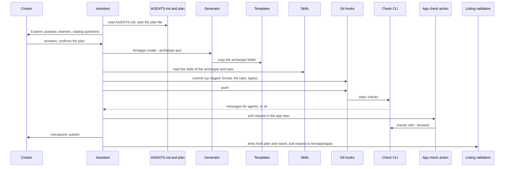
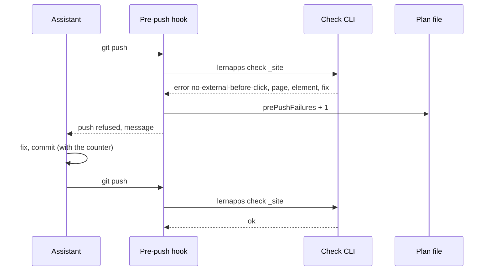
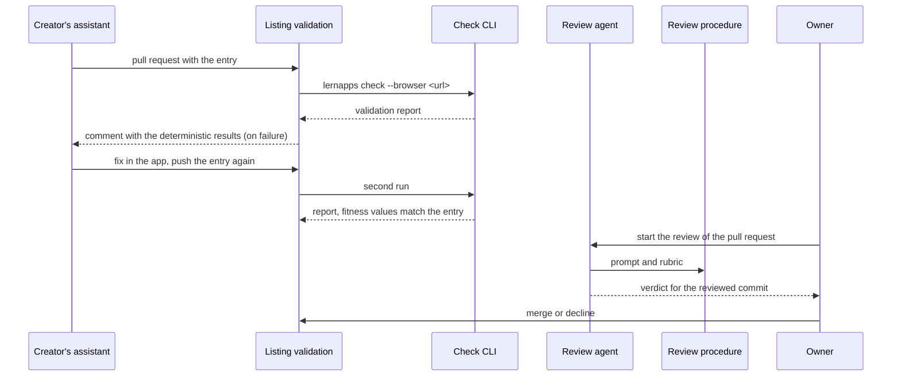
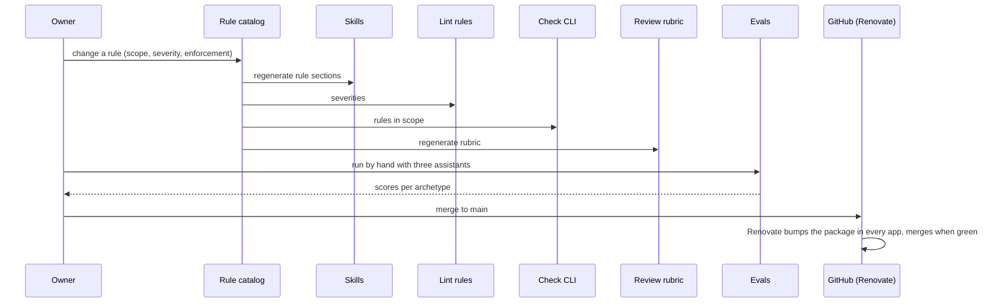

# Runtime View

Four scenarios show how the building blocks work together: a new app from first prompt to listing pull request, a
failing push, the validation of a listing, and a rule that changes.

## A new app, from first prompt to listing

The creator asks their assistant for an app. The assistant reads `AGENTS.md`, explores the idea with the creator in
the plan file and confirms the plan with them. Then it works on its own: it generates the scaffold, builds with the
skills and the hooks' feedback, publishes, and lists the app from the plan and the validation report.

```arc42
:::runtime-scenario
id: rs-new-app
title: A new app, from first prompt to listing
trigger: A creator asks their AI assistant for a learning app
involves: bb-process-guidance, bb-generator, bb-app-template, bb-skills, bb-archetypes, bb-lint-rules, bb-git-hooks, bb-check-cli, bb-app-check-action, bb-listing-validation
:::
```

```arc42
:::diagram
id: rs-new-app-sequence
scenario: rs-new-app
notation: mermaid-sequence
aliases: creator=actor-creator, assistant=actor-assistant, guidance=bb-process-guidance, generator=bb-generator, templates=bb-app-template, skills=bb-skills, hooks=bb-git-hooks, check=bb-check-cli, ci=bb-app-check-action, listing=bb-listing-validation
:::
```



## A push fails

The pre-push hook finds a request to another server in a built page. It prints the message, counts the failure in the
plan's front matter, and the assistant fixes the app without asking the creator.

```arc42
:::runtime-scenario
id: rs-push-fails
title: A push fails
trigger: The assistant pushes a commit that breaks a checked rule
involves: bb-git-hooks, bb-check-cli, bb-process-guidance
:::
```

```arc42
:::diagram
id: rs-push-fails-sequence
scenario: rs-push-fails
notation: mermaid-sequence
aliases: assistant=actor-assistant, hooks=bb-git-hooks, check=bb-check-cli, plan=bb-process-guidance
:::
```



## A listing is validated

A pull request adds an entry to lernapps/apps. The listing validation checks the deployed app and compares the
report with the entry. On failure it comments the deterministic results; the creator's assistant fixes the app and
pushes again. Then the review agent judges the rest and the owner decides.

```arc42
:::runtime-scenario
id: rs-listing-validated
title: A listing is validated
trigger: A pull request to lernapps/apps adds or changes an entry
involves: bb-listing-validation, bb-check-cli, bb-review-procedure
:::
```

```arc42
:::diagram
id: rs-listing-validated-sequence
scenario: rs-listing-validated
notation: mermaid-sequence
aliases: assistant=actor-assistant, listing=bb-listing-validation, check=bb-check-cli, review=actor-review-agent, procedure=bb-review-procedure, owner=actor-owner
:::
```



## A rule changes

The owner tightens a rule, or a creator contributes one. The catalog changes in one place; skills, lint rules,
checks and rubric follow; the evals run; after the merge, Renovate brings the new package commit to every app.

```arc42
:::runtime-scenario
id: rs-rule-changes
title: A rule changes
trigger: A pull request to lernapps/tooling changes the rule catalog
involves: bb-rule-catalog, bb-skills, bb-lint-rules, bb-check-cli, bb-review-procedure, bb-evals
:::
```

```arc42
:::diagram
id: rs-rule-changes-sequence
scenario: rs-rule-changes
notation: mermaid-sequence
aliases: owner=actor-owner, catalog=bb-rule-catalog, skills=bb-skills, lint=bb-lint-rules, check=bb-check-cli, procedure=bb-review-procedure, evals=bb-evals, github=actor-github
:::
```


