# Deployment View

The tooling has no server of its own. It runs where the creator works, in the creator's agent harness, in an
environment for the agents lernapps defines, and in GitHub Actions; its sources and published pages live on GitHub.
Apps themselves are hosted on lernapps.net's GitHub Pages or anywhere else; they are not building blocks of the
tooling.

## Deployment overview

```arc42
:::diagram
id: deployment-overview
view: deployment
notation: mermaid-architecture
aliases: creator=dn-creator-machine, harness=dn-agent-harness, agents=dn-lernapps-agents, github=dn-github, toolingrepo=dn-tooling-repo, templaterepo=dn-templates-repo, appci=dn-app-ci, appsci=dn-apps-ci, generator=bb-generator, hooks=bb-git-hooks, checklocal=bb-check-cli, skills=bb-skills, guidance=bb-process-guidance, package=bb-tooling-package, templates=bb-app-templates, appcheck=bb-app-check-action, listing=bb-listing-validation, review=bb-review-procedure, evals=bb-evals
:::
```



```mermaid
architecture-beta
    group creator(server)[Creator]
    group harness(server)[Harness] in creator
    group agents(server)[Agents]
    group github(cloud)[GitHub]
    group toolingrepo(disk)[tooling] in github
    group templaterepo(disk)[templates] in github
    group appci(server)[AppCI] in github
    group appsci(server)[AppsCI] in github
    service guidance(server)[Guidance] in harness
    service skills(server)[Skills] in harness
    service generator(server)[Generator] in creator
    service hooks(server)[Hooks] in creator
    service checklocal(server)[Check] in creator
    service review(server)[Review] in agents
    service evals(server)[Evals] in agents
    service package(disk)[Package] in toolingrepo
    service templates(disk)[Templates] in templaterepo
    service appcheck(server)[AppCheck] in appci
    service listing(server)[Listing] in appsci
    generator:R --> L:package
    generator:B --> T:templates
    hooks:R --> L:checklocal
    appcheck:L --> R:package
    listing:T --> B:package
    review:R --> L:listing
```

## Creator's machine

The creator's computer or their assistant's sandbox, with the app repo. `npm ci` installs the tooling package into
the app; the generator runs once; the hooks run the check command on every commit and push. The pre-push part
needs a browser for the end-to-end tests; the preset installs Playwright's browser once and caches it, and the check
says clearly when a sandbox cannot run one.

```arc42
:::deployment-node
id: dn-creator-machine
title: Creator's machine or assistant sandbox
type: device
hosts: bb-tooling-package, bb-generator, bb-archetypes, bb-git-hooks, bb-lint-rules, bb-check-cli
:::
```

### Creator's agent harness

The runtime of the creator's assistant: Claude Code, Codex, Gemini CLI or another agent. Guidance reaches the
assistant here: `AGENTS.md` at the app's root, which every harness reads, and the skills, synced from the package
into the harness's skill folder (e.g. `.agents/skills/`, `.claude/skills/`). The harness decides when to load a
skill; agent-specific hooks of the harness may add convenience but carry no enforcement.

```arc42
:::deployment-node
id: dn-agent-harness
title: Creator's agent harness
type: environment
parent: dn-creator-machine
hosts: bb-process-guidance, bb-skills
:::
```

## Environment for lernapps agents

The environment where agents defined by lernapps run: the review agent on a listing pull request, and the eval runs
with Claude Code, Codex and Gemini CLI. Today it is the owner's machine; it can move to a dedicated environment
without changing the blocks.

It holds a checkout of lernapps/tooling at `main` with its dependencies installed. For a review, the owner starts a
fresh agent there with the prompt `review/prompt.md`, the app's repo and the commit to review. The agent works in a
directory of its own per review (`.reviews/`, ignored by git): it clones the app at that commit, builds the bundle,
runs the check CLI for the validation report, and writes the verdict next to it. The owner posts the verdict on the
listing pull request; nothing else leaves the environment.

```arc42
:::deployment-node
id: dn-lernapps-agents
title: Environment for lernapps agents
type: environment
hosts: bb-tooling-package, bb-review-procedure, bb-evals, bb-check-cli
:::
```

## GitHub

The means of production (`con-github`).

```arc42
:::deployment-node
id: dn-github
title: GitHub
type: cloud-region
:::
```

### lernapps/tooling

Source of the package and of the app check action; apps install the package from git at a commit of `main`, which
Renovate keeps current. Its Pages at lernapps.net/tooling/ publish the documentation and the schema of the
validation report.

```arc42
:::deployment-node
id: dn-tooling-repo
title: lernapps/tooling repository
type: environment
parent: dn-github
hosts: bb-tooling-package, bb-app-check-action
:::
```

### lernapps/app-templates

The archetype templates, one folder each, read by the generator at the commit pinned in the package, and the
runtime package at the root, which every app installs from here at a commit.

```arc42
:::deployment-node
id: dn-templates-repo
title: lernapps/app-templates repository
type: environment
parent: dn-github
hosts: bb-app-templates
:::
```

### App repo CI

GitHub Actions of each app repo: the app check action runs the check command without flags, the same checks the
hooks ran, on every pull request and push; apps on lernapps.net deploy with the site actions afterwards.

```arc42
:::deployment-node
id: dn-app-ci
title: App repo CI (GitHub Actions)
type: container
parent: dn-github
hosts: bb-app-check-action, bb-check-cli
:::
```

### lernapps/apps CI

GitHub Actions of the app overview: the listing validation on pull requests that add or change an entry.

```arc42
:::deployment-node
id: dn-apps-ci
title: lernapps/apps CI (GitHub Actions)
type: container
parent: dn-github
hosts: bb-listing-validation, bb-check-cli
:::
```
