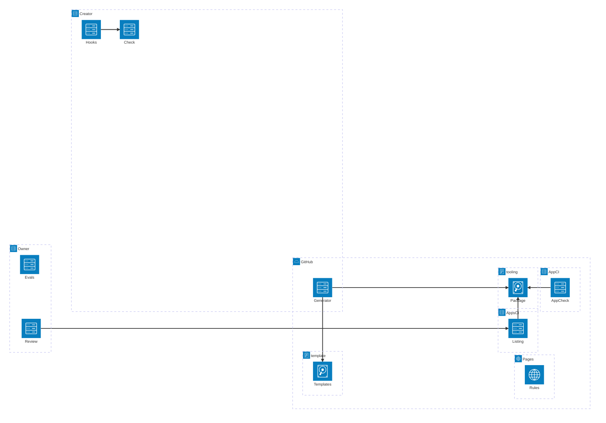

# Deployment View

The tooling has no server. It runs where the creator and the owner work, and in GitHub Actions; its sources and
published pages live on GitHub. Apps themselves are hosted on lernapps.net's GitHub Pages or anywhere else; they are
not building blocks of the tooling.

## Deployment overview

```arc42
:::diagram
id: deployment-overview
view: deployment
notation: mermaid-architecture
aliases: creator=dn-creator-machine, owner=dn-owner-machine, github=dn-github, toolingrepo=dn-tooling-repo, templaterepo=dn-template-repo, appci=dn-app-ci, appsci=dn-apps-ci, pages=dn-pages, generator=bb-generator, hooks=bb-git-hooks, checklocal=bb-check-cli, package=bb-tooling-package, templates=bb-app-template, appcheck=bb-app-check-action, listing=bb-listing-validation, review=bb-review-procedure, evals=bb-evals, catalog=bb-rule-catalog
:::
```



## Creator's machine

The creator's computer or their assistant's sandbox. The package is installed into the app by `npm ci`; the
generator runs once; the hooks and the static part of the check CLI run on every commit and push. Browser checks
need Chromium and run in CI instead (decision `dec-browser-checks-in-ci`).

```arc42
:::deployment-node
id: dn-creator-machine
title: Creator's machine or assistant sandbox
type: device
hosts: bb-tooling-package, bb-process-guidance, bb-generator, bb-skills, bb-archetypes, bb-archetype-explainer, bb-archetype-interactive, bb-archetype-quiz, bb-git-hooks, bb-lint-rules, bb-check-cli
:::
```

## Owner's machine

Where the owner runs the review agent on a listing pull request and the evals by hand with Claude Code, Codex and
Gemini CLI (decisions `dec-review-by-owner`, `dec-evals-by-hand`).

```arc42
:::deployment-node
id: dn-owner-machine
title: Owner's machine
type: device
hosts: bb-review-procedure, bb-evals, bb-check-cli
:::
```

## GitHub

The means of production (`con-github`).

```arc42
:::deployment-node
id: dn-github
title: GitHub
type: cloud-region
:::
```

### lernapps/tooling

Source of the package and of the app check action; apps install the package from git at a commit of `main`, which
Renovate keeps current.

```arc42
:::deployment-node
id: dn-tooling-repo
title: lernapps/tooling repository
type: environment
parent: dn-github
hosts: bb-tooling-package, bb-app-check-action
:::
```

### lernapps/app-template

The archetype templates, one folder each, read by the generator at the commit pinned in the package.

```arc42
:::deployment-node
id: dn-template-repo
title: lernapps/app-template repository
type: environment
parent: dn-github
hosts: bb-app-template
:::
```

### App repo CI

GitHub Actions of each app repo: the app check action with browser checks on every pull request and push; apps on
lernapps.net deploy with the site actions afterwards.

```arc42
:::deployment-node
id: dn-app-ci
title: App repo CI (GitHub Actions)
type: container
parent: dn-github
hosts: bb-app-check-action, bb-check-cli
:::
```

### lernapps/apps CI

GitHub Actions of the app overview: the listing validation on pull requests that add or change an entry.

```arc42
:::deployment-node
id: dn-apps-ci
title: lernapps/apps CI (GitHub Actions)
type: container
parent: dn-github
hosts: bb-listing-validation, bb-check-cli
:::
```

### lernapps.net Pages

GitHub Pages of the organisation: the tooling's documentation at lernapps.net/tooling/ with the architecture and the
rule catalog page, the validation report schema next to the entry schema, and apps hosted on lernapps.net.

```arc42
:::deployment-node
id: dn-pages
title: lernapps.net (GitHub Pages)
type: environment
parent: dn-github
hosts: bb-rule-catalog
:::
```
